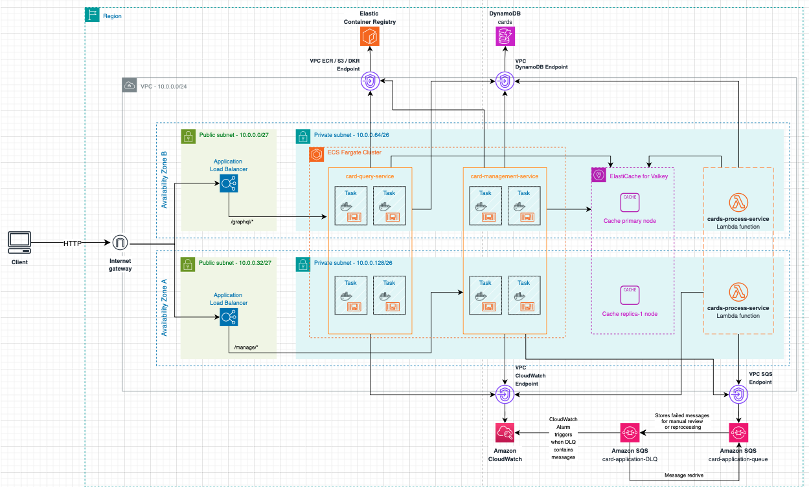

# Cards Project v.1.0

This project is part of a microservice architecture responsible for managing cards linked to bank accounts. The service provides RESTful APIs for creating, fetching, updating, and deleting card information. The system leverages various AWS services and modern software development practices to ensure scalability, security, and maintainability.

## Tech Stack

### Languages & Frameworks:

- **Java 21**: Core programming language.
- **Micronaut 4.5.0+**: Framework used to build the microservice with lightweight, fast startup times and cloud-native capabilities.
- **GraphQL**: Used in the query-cards-service for efficient and flexible querying of card-related data, allowing clients to request only the data they need.

### Infrastructure:

- **Amazon DynamoDB**: NoSQL database used for storing card information.
- **AWS Lambda**: Serverless compute platform for running the process-cards-service. It handles event-driven tasks, such as processing card-related operations from Amazon SQS, without the need to manage underlying servers.
- **Amazon ECS Fargate**: A fully managed container orchestration service used to run the manage-cards-service container. It allows for secure and scalable execution of containers without managing underlying infrastructure, running in private subnets for improved security.
- **Amazon EC2 Instance**: Virtual machines used to run the query-cards-service.jar in a private subnet, providing flexibility and control over compute resources.
- **Application Load Balancer (ALB)**: A managed load balancer used to distribute incoming HTTP/HTTPS traffic from the internet to backend services (ECS tasks and EC2 instances). It resides in public subnets and ensures high availability and scalability.
- **Terraform**: Infrastructure as Code (IaC) tool used for managing AWS resources like DynamoDB, Lambda, API Gateway, ECS, ALB, and EC2 instances.
- **LocalStack**: A fully functional local AWS cloud stack used for local testing of AWS services like DynamoDB, Lambda, and ECS.

### Authentication:

- No authentication is implemented in this version, keeping the API accessible for internal use. Future versions may include authentication and authorization mechanisms for enhanced security when used in external environments.

### CI/CD & Containerization:

- **GitHub Actions:** Automated pipeline for building, testing, and deploying the microservice.
- **Docker:** Used to containerize the application for local development and deployment.
- **Amazon ECR (Elastic Container Registry)**: A fully managed container registry used to store and manage Docker images securely. The project’s Docker images are pushed to ECR, allowing seamless integration with ECS Fargate for deployment and scaling.

### Testing:

- **JUnit 5:** Framework used for unit and integration testing of the microservice.
- **Mockito:** Library used for mocking dependencies to isolate and test components effectively.
- **AssertJ:** Library used for fluent and readable assertion statements, enhancing test clarity.
- **TestContainers:** Library used to spin up temporary containers for integration testing with services like DynamoDB, SQS, and LocalStack, ensuring tests run in realistic environments.

### Documentation:

- **OpenAPI (via Swagger UI)**: Provides API documentation and an interactive testing interface to explore the RESTful endpoints.

## Features

- **Card Management**: Create, fetch, update, and delete cards linked to a bank account. The query-cards-service uses GraphQL to enable flexible and efficient querying, allowing clients to request exactly the data they need.
- **Infrastructure as Code:** AWS infrastructure is managed and deployed using Terraform.
- **Local Testing:** Fully local development setup using JUnit 5, Mockito, AssertJ, LocalStack and TestContainers.
- **CI/CD Pipeline:** GitHub Actions for continuous integration and deployment.

## Project Architecture

